# T5 Desk Assistant - Architecture Diagrams

These diagrams show the complete system architecture for the T5 Desk Assistant production-ready version.

---

## 1. SYSTEM ARCHITECTURE DIAGRAM

```mermaid
graph TB
    subgraph Hardware["⚙️ HARDWARE LAYER"]
        CPU["Tuya T5 Dev Board<br/>Quad-Core ARM 2GB RAM"]
        Mic["🎤 Microphone Array<br/>4-Mic Far-Field"]
        Disp["📱 5-inch LCD Display<br/>Touch Enabled"]
        Spk["🔊 Stereo Speakers<br/>3W + 3W"]
        Sensors["📊 Sensors<br/>Temp, Motion, Light"]
        Bat["🔋 Battery System<br/>5000mAh + USB-C"]
    end

    subgraph Software["💻 SOFTWARE LAYER"]
        subgraph VoiceEngine["🎙️ Voice Intelligence"]
            HW["Hotword Detection<br/>Local Processing"]
            STT["Speech-to-Text<br/>Google Cloud API"]
            NLU["Natural Language<br/>Understanding"]
            TTS["Text-to-Speech<br/>Google Cloud API"]
        end

        subgraph Services["🔧 Core Services"]
            ScheduleService["📅 Schedule Manager<br/>Google Calendar API"]
            HealthService["❤️ Health Monitor<br/>Wearable APIs"]
            TuyaService["🏠 Tuya Controller<br/>Smart Devices"]
            UIService["🖥️ UI Manager<br/>Display & Touch"]
        end

        subgraph Runtime["⚡ Runtime"]
            OSLayer["TuyaOS Kernel<br/>Linux-based"]
            HAL["Hardware Abstraction<br/>Drivers & GPIO"]
        end
    end

    subgraph Cloud["☁️ CLOUD INTEGRATION"]
        GoogleAPIs["Google Cloud<br/>Calendar, Speech, TTS"]
        TuyaCloud["Tuya Cloud API<br/>Device Control"]
        OptionalLLM["Optional LLM<br/>Advanced Q&A"]
        Analytics["Analytics &<br/>Telemetry"]
    end

    subgraph Data["💾 DATA LAYER"]
        LocalStorage["Encrypted Local Storage<br/>Preferences & Cache"]
        CloudBackup["Cloud Backup<br/>Schedule & Settings"]
    end

    %% Connections
    Mic --> VoiceEngine
    CPU --> VoiceEngine
    CPU --> Services
    CPU --> OSLayer
    HAL --> Hardware
    Disp --> UIService
    Spk --> TTS
    Sensors --> HealthService

    Services --> Cloud
    VoiceEngine --> Cloud
    GoogleAPIs --> ScheduleService
    GoogleAPIs --> STT
    GoogleAPIs --> TTS
    TuyaCloud --> TuyaService

    Services --> Data
    Cloud --> Data

    style Hardware fill:#e1f5ff
    style Software fill:#f3e5f5
    style Cloud fill:#fff3e0
    style Data fill:#e8f5e9
```



---

## 2. HARDWARE CONNECTION DIAGRAM

```mermaid
graph LR
    subgraph Board["Tuya T5 Dev Board"]
        CPU["CPU<br/>ARM Processor"]
        GPIO["GPIO Pins<br/>PWM/Digital/I2C"]
        WiFi["WiFi Module<br/>802.11ax"]
        Audio["Audio Codec<br/>In/Out"]
    end

    subgraph Input["INPUT DEVICES"]
        MicArray["🎤 Mic Array<br/>I2S Interface"]
        MotionSensor["📍 Motion Sensor<br/>GPIO"]
        LightSensor["💡 Light Sensor<br/>I2C/ADC"]
        TouchScreen["📱 Touchscreen<br/>SPI/GPIO"]
    end

    subgraph Output["OUTPUT DEVICES"]
        LCD["📺 LCD Display<br/>SPI Interface"]
        Speaker["🔊 Speakers<br/>I2S/Analog"]
        LEDs["💡 Status LEDs<br/>GPIO"]
    end

    subgraph Power["POWER SYSTEM"]
        USBPower["⚡ USB-C Input<br/>12V/2A"]
        Battery["🔋 Li-ion Battery<br/>5000mAh"]
        PMU["Power Management<br/>Unit"]
    end

    subgraph Network["NETWORK"]
        WiFiAnt["WiFi Antenna<br/>6 dBi"]
        BLE["Bluetooth 5.1<br/>Optional"]
    end

    %% Input Connections
    MicArray -->|I2S| Audio
    MotionSensor -->|GPIO Pin 1| GPIO
    LightSensor -->|I2C| GPIO
    TouchScreen -->|SPI| CPU

    %% Output Connections
    LCD -->|SPI| CPU
    Speaker -->|I2S| Audio
    LEDs -->|GPIO Pin 2-4| GPIO

    %% Power Connections
    USBPower --> PMU
    Battery --> PMU
    PMU --> CPU

    %% Network Connections
    WiFiAnt --> WiFi
    WiFi --> CPU
    BLE --> CPU

    %% CPU Central Hub
    Audio --> CPU
    GPIO --> CPU
    
    style Board fill:#e3f2fd
    style Input fill:#fce4ec
    style Output fill:#f1f8e9
    style Power fill:#ffe0b2
    style Network fill:#e0f2f1
```



---

## 3. SOFTWARE ARCHITECTURE LAYERS

```mermaid
graph TB
    subgraph Layer1["LAYER 1: Hardware Abstraction"]
        Bootloader["Bootloader & Kernel"]
        Drivers["Device Drivers"]
        GPIO["GPIO/PWM Control"]
        Power["Power Management"]
    end

    subgraph Layer2["LAYER 2: Voice Intelligence Engine"]
        Hotword["🎙️ Hotword Detection<br/>Local - Always On"]
        STT["Speech-to-Text<br/>Cloud API"]
        NLU["Intent & Entity<br/>Recognition"]
        TTS["Text-to-Speech<br/>Cloud API"]
    end

    subgraph Layer3["LAYER 3: Core Services"]
        ScheduleServ["📅 Schedule Manager"]
        HealthServ["❤️ Health Monitor"]
        DeviceServ["🏠 Device Controller"]
        WakeServ["⚡ Wake & Sleep Manager"]
    end

    subgraph Layer4["LAYER 4: User Interface"]
        Display["🖥️ Display Engine<br/>Card-Based UI"]
        Voice["🎤 Voice Interface<br/>Command & Feedback"]
        Touch["👆 Touch Interface<br/>Gestures & Buttons"]
    end

    subgraph Layer5["LAYER 5: Cloud Integration"]
        GoogleAPI["Google Cloud<br/>Calendar, Voice, TTS"]
        TuyaAPI["Tuya Cloud API<br/>Device Control"]
        OptLLM["LLM Service<br/>Q&A Fallback"]
    end

    subgraph Layer6["LAYER 6: Cloud Services"]
        CloudGW["API Gateway<br/>Rate Limiting"]
        DevMgmt["Device Management<br/>Firmware Updates"]
        Storage["Preference Storage<br/>Encryption"]
    end

    %% Connections
    Drivers --> Hotword
    Power --> WakeServ
    
    Hotword --> STT
    STT --> NLU
    NLU --> ScheduleServ
    NLU --> HealthServ
    NLU --> DeviceServ
    
    ScheduleServ --> Display
    HealthServ --> Display
    DeviceServ --> Display
    Display --> TTS
    
    TTS --> Voice
    Voice --> Hotword
    Touch --> ScheduleServ
    
    ScheduleServ --> GoogleAPI
    GoogleAPI --> CloudGW
    DeviceServ --> TuyaAPI
    TuyaAPI --> CloudGW
    
    NLU --> OptLLM
    OptLLM --> CloudGW
    
    CloudGW --> DevMgmt
    CloudGW --> Storage

    style Layer1 fill:#bbdefb
    style Layer2 fill:#c5cae9
    style Layer3 fill:#f8bbd0
    style Layer4 fill:#b2dfdb
    style Layer5 fill:#fff9c4
    style Layer6 fill:#ffe0b2
```



---

## 4. DATA FLOW: VOICE COMMAND

```mermaid
sequenceDiagram
    participant U as User
    participant HW as Device Hotword
    participant VA as Voice Agent
    participant NLU as Intent Classifier
    participant SVC as Service Layer
    participant CLOUD as Cloud APIs
    participant DB as Local Storage

    U->>HW: "Hey T5..."
    HW->>VA: Hotword Detected
    VA->>HW: Start Recording
    U->>HW: "What's next on my calendar?"
    HW->>VA: Audio Stream
    VA->>CLOUD: Speech-to-Text
    CLOUD->>VA: "what's next on my calendar"
    VA->>NLU: Process Intent
    NLU->>SVC: SCHEDULE_QUERY Intent
    SVC->>DB: Get Cached Calendar
    DB->>SVC: Return Recent Events
    SVC->>CLOUD: Sync with Google Calendar
    CLOUD->>SVC: Return Latest Events
    SVC->>DB: Update Cache
    SVC->>VA: "Next: Design Review at 2 PM"
    VA->>CLOUD: Text-to-Speech
    CLOUD->>VA: Audio File
    VA->>HW: Play Audio + Show Display
    HW->>U: Spoken Response + Visual Info

    style HW fill:#e1f5ff
    style VA fill:#f3e5f5
    style NLU fill:#fce4ec
    style SVC fill:#e8f5e9
    style CLOUD fill:#fff3e0
    style DB fill:#ede7f6
```

---

## 5. DATA FLOW: HEALTH REMINDER

```mermaid
sequenceDiagram
    participant MOT as Motion Sensor
    participant HEALTH as Health Service
    participant TIMER as Timer
    participant UI as Display
    participant VOICE as Speaker
    participant LOG as Event Log

    TIMER->>TIMER: 90 min interval
    TIMER->>MOT: Check Motion?
    MOT->>HEALTH: User Present (Yes)
    HEALTH->>UI: Show Reminder Card
    HEALTH->>VOICE: Play Alert Sound
    UI->>UI: Fade Alert
    par User Interaction
        UI->>HEALTH: User Acknowledges
    and Logging
        HEALTH->>LOG: Record Sedentary Event
        LOG->>LOG: Update Health Score
    end
    HEALTH->>UI: Update UI State
    UI->>UI: Display Health Summary

    style MOT fill:#fce4ec
    style HEALTH fill:#e8f5e9
    style TIMER fill:#fff3e0
    style UI fill:#b2dfdb
    style VOICE fill:#f3e5f5
    style LOG fill:#ede7f6
```

---

## 6. API INTEGRATION ARCHITECTURE

```mermaid
graph TB
    subgraph Device["T5 Device"]
        App["T5 App"]
        Cache["Local Cache"]
    end

    subgraph GoogleCloud["Google Cloud Services"]
        CalAPI["📅 Calendar API"]
        SpeechAPI["🎙️ Speech-to-Text"]
        TTSAPI["🔊 Text-to-Speech"]
        FitAPI["💪 Google Fit API"]
    end

    subgraph TuyaCloud["Tuya Cloud Platform"]
        DevAPI["🏠 Device API"]
        MgmtAPI["⚙️ Device Management"]
        AuthAPI["🔐 OAuth2 Auth"]
    end

    subgraph Optional["Optional/Future"]
        OpenAI["OpenAI API<br/>Advanced Q&A"]
        WeatherAPI["Weather Service<br/>Forecasts"]
    end

    subgraph Local["Local Services"]
        Hotword["Hotword Detection"]
        Storage["Encrypted Storage"]
    end

    %% Connections
    App -->|REST + OAuth2| CalAPI
    App -->|gRPC| SpeechAPI
    App -->|REST| TTSAPI
    App -->|REST| FitAPI
    
    App -->|MQTT| AuthAPI
    AuthAPI -->|Token| DevAPI
    App -->|REST| DevAPI
    TuyaCloud -->|Telemetry| MgmtAPI

    App -->|REST| OpenAI
    App -->|REST| WeatherAPI
    
    App --> Hotword
    App --> Storage
    Storage --> Cache
    Cache --> App

    style Device fill:#e1f5ff
    style GoogleCloud fill:#fff3e0
    style TuyaCloud fill:#fce4ec
    style Optional fill:#f3e5f5
    style Local fill:#e8f5e9
```



---

## 7. DEPLOYMENT ARCHITECTURE


---

## 🎨 Color Legend

| Color | Represents |
|-------|-----------|
| 🔵 Blue | Hardware & Local Processing |
| 🟣 Purple | Voice & AI Processing |
| 🟡 Yellow | Cloud Services (Google) |
| 🟢 Green | Data & Storage |
| 🩷 Pink | Smart Home (Tuya) |
| 🔶 Orange | User Interface |

---

These diagrams show how all components work together in the **production-ready T5 Desk Assistant system**! 🚀
